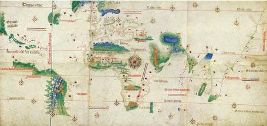
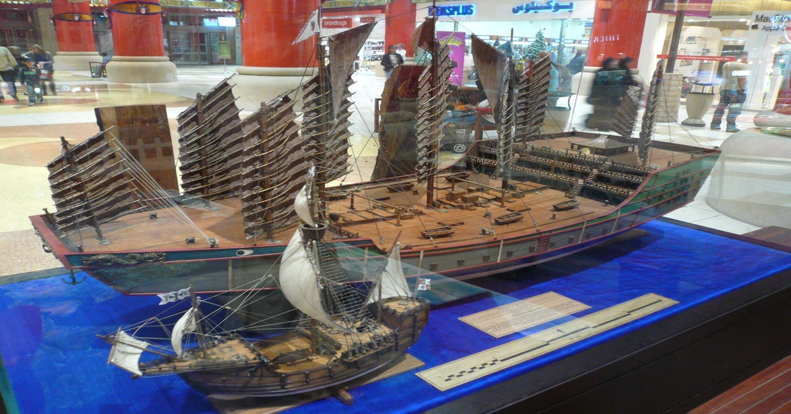

### _09 February 2023_

# Composite Monarchy and a European Rise to Power

There was more parity than one might have expected at the time

## Political situation in Europe

Composite Monarchy

- Many different monarchies that were powerful in their own
right but not united
- Non-contiguous empires

### Spanish Monarchy

The Reconquista (AD 722-1492)

- Slowly recapturing the Iberian penninsula from the Moors
- No one expects the Spanish Inquisition
- Except they did
- Captured Grenada in 1492
- Mosques are turned into cathedrals
- Córdoba and Grenada

## Spanish and Portuguese Expansion

Treaty of Tordesillas

- Split colonies between Spain and Portugal across a longitude
line
- Portuguese get Brazil and East, Spain gets west

## Note!

Europe wasn't novel in its discoveries of advanced ships!
In fact, their ships are dwarfed by ships made by the Chinese
earlier that century, and the Chinese had made long-distance
travel like this before.

## Portuguese Empire

- Protection
- Pass system
- Enclaves / factories / militarized entrepôts
- Navy as defense and offense
- Local colonial authorities
- Did not disrupt major existing empires
- Reciprocal commercial relationship
- Imperial rivalry between Dutch, Portuguese, and English

## First corporations

- Joint-stock companies
- Own legal personality
- Charter companies
- Granted monopolies
- State-like powers of legiitmate violence
- \`\`Outsourcing empire"
- Includes British East India Company (EIC) and Dutch East Indes Co. (VOC)

## Mercantilism

- Constraining trade within boundaries of empire-state
- Wealth measured in land, precious metals, population
- Militalized war-footing with a strong economy
