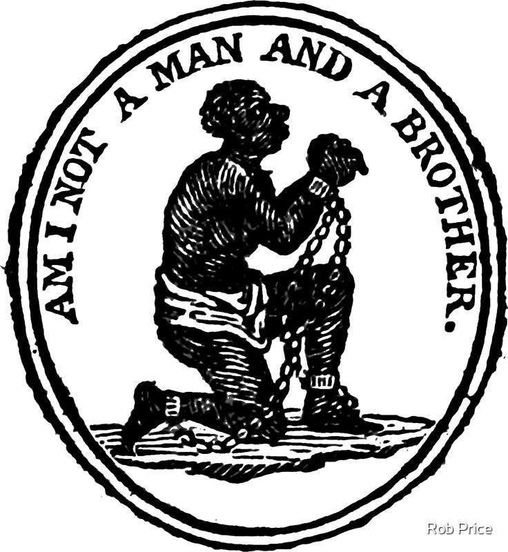

### _06 March 2023_

# Rationale of Emancipation, Dependent Nations, and Aliens

## Colonization of Africa

- Justified as a civilizing mission
  - Improve mankind
  - Christianity

## Globalization with Nationalism

- Inter-imperial competition
- Also cooperation across empires
- Nations care about their own people only
- Liberalism, laissez-faire
- Need for commercial expansion (profits)
- Paternalism (civilize the uncivilized)
- Humanitarianism
- Social imperialism: improving their working class by
making all working class people feel superior as white
people instead of inferior as low class

## Emancipation Movement

- Universalism
- Symbol started as a porcelain manufacturer's design
- Appeal to common humanity
- Appeal to family values and Christianity
- Diminished masculinity
- Image of abjection seeking white salvation

{width=50%}

### Why Oppose Slavery

Wilberforce

- Christian morality
- Restore free trade

Smith

- Deteriorization of workforce
- Free laborers maximize their labor better

## Treatment of Natives

- Not seen as nations, nation outside the US
- Quasi sovereignty, dependent nation
- Nomadism
- Occupation vs ownership
- Doctrine of discovery
- \`\`Legalized squatting"
- US imperialism

## Treatment of Chinese

- Seen as a threat to white people
- Actively excluded
- Tighter restrictions on passports, closed borders

## Defining Citizenship

- System of rights and obligations
- The state wasn't really doing anything for people
before this
- Citizenship wouldn't have meant much before the 1800s
- Soon being a citizen meant having more freedoms or
rights

