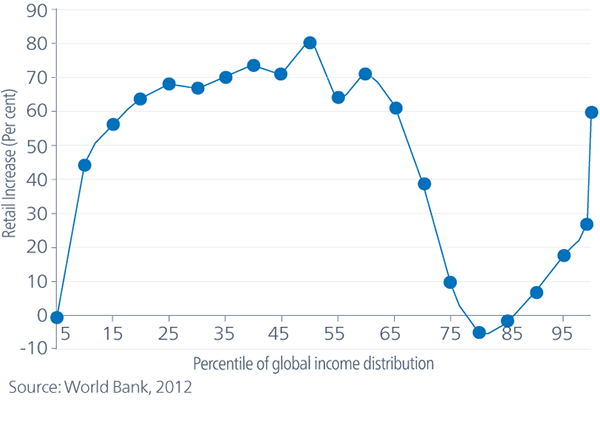

### _01 May 2023_

# Concepts, Narratives, and Chains

## Neoliberalism

- Market ethic
- The economy does its own rebalancing / redistribution
- Era of neoliberalism since the 1970s
- Volcker shock in 1979, 3^rd^ world debt crisis
- Reagan in US, Thatcher in UK, 1980s (right wing)
- Clinton in US, Blair in UK, Schröder in Germany, 1990s (left wing)

## Supply Chains

- 5 years ago (2018), this word was not in the mainstream
- Offshoring, outsourcing starting in the 1980s
- Fragmentation of the supply chain

## Sacrificial Order

- Who and what will you sacrifice to build the world order?
- Even though the international system says it's built on
  equality, it isn't equal because of these sacrifices
- With Covid, economics were prioritized over health
  - "essential workers" as a category represents this
- Racism is not just about a bad sentiment in people's hearts but
  also about hard-wired issues in political and economic structures
- Utilitarian, like "just war"

## Biopolitics

- Making live and letting die

## Populist

- Right wing people blame increase in income for middle income percentile
  people like workers in China for taking away money from American workers
- Left wing people blame increase in income for the top 1% for the decrease
  in income for American workers

## Chains of Globalization

- Fragmented supply chains for semiconductors and chips
- Industrial policy can reverse effects of fragmented supply chains
- Offshoring
  - Nearshoring
  - Friendshoring
  - Reshoring
- Trade rivalries related to national security concerns
- Decoupling, delinking
- Geoeconomic relationship between the US and China is always changing
- Resource scaricty
- Dollar system is the US Dollar
  - The US is like firefighters
- Allow for world trade but also allow for sanctions

